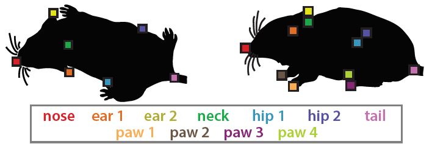

This fork of pycocotools from the COCO API was made to allow evaluation of mouse pose estimates that use the MARS keypoint definitions:

The code is largely unchanged, however the sigmas used for Object Keypoint Similarity have been modified to reflect the values estimated from the MARS dataset; this change was made in pycocotools/cocoeval.py. The Matlab and Lua versions of the original CoCo API have been removed for simplicity.

### Installation
Installation on Windows requires Microsoft Visual C++ Build Tools from [here](https://visualstudio.microsoft.com/visual-cpp-build-tools/).

To install locally, call:
`python setup.py build_ext --inplace`

To install to the Python site-packages, call:
`python setup.py build_ext install`

TODO:
* Jupyter notebooks have not yet been updated.

The original COCO API can be found [here](https://github.com/cocodataset/cocoapi).
