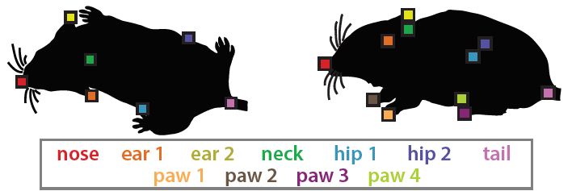
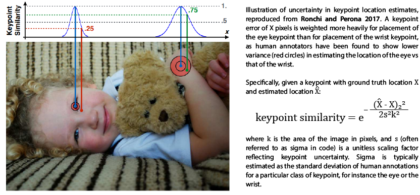

### About
This is a fork of pycocotools from the COCO API, made to allow evaluation of mouse pose estimates that use the MARS keypoint definitions:



The code is largely unchanged, however the sigmas used for Object Keypoint Similarity have been modified to reflect the values estimated from the MARS dataset; this change was made in MARSeval/cocoeval.py. The Matlab and Lua versions of the original CoCo API have been removed for simplicity.

The original COCO API can be found [here](https://github.com/cocodataset/cocoapi).

### Installation
Note: in the future, this will come pre-installed in the `mars_dev` conda environment of [https://github.com/neuroethology/MARS_Developer](https://github.com/neuroethology/MARS_Developer).

#### Linux
In progress.

#### Windows
If you don't have them, install:
* Microsoft Visual C++ Build Tools- download from [here](https://visualstudio.microsoft.com/visual-cpp-build-tools/).
* Cython - call `pip install cython`.

then, call:
```
pip install git+https://github.com/neuroethology/MARS_pycocotools.git#egg=MARSeval^&subdirectory=PythonAPI
```

### Additions to the Keypoint API

The original COCO API includes several metrics for evaluating the accuracy of keypoint-based pose estimates. We expand one of these, the Object Keypoint Similarity (OKS) metric, to include estimates of human accuracy in mouse pose estimation.

Keypoint Similarity is a measure of keypoint estimation accuracy that takes into account human uncertainty about the location of different body parts. Clearly defined parts, like the eye in the picture below, are often annotated with high consistency by different human annotators, while less clear parts, like the wrist or elbow, show more inter-annotator variability. The OKS metric therefore normalizes keypoint estimation error by the variance of human annotations to obtain a measure of pose accuracy.




In the original `pycocotools`, the scaling factor Sigma is estimated from the variance of human annotations of human pose keypoints; values range from 0.025 to 0.11, depending on the body part.

`MARSeval` supplements these Sigmas with scaling factors estimated from the variance of human annotations of mouse body parts in the MARS pose dataset. The Sigma values used may be specified when a `COCOeval` object is instantiated:

```
cocoEval = COCOeval(gt_data, pred_data, iouType='keypoints', sigmaType='MARS_top', useParts=parts)
```
where `gt_data` and `pred_data` are your ground-truth and predicted keypoint locations in the COCO format, and `parts` is a list of the body parts you would like to evaluate, in the order they appear in `pred_data`. The following values of `sigmaType` and `useParts` are available:

* **human**: nose, right eye, left eye, right ear, left ear, right shoulder, left shoulder, right elbow, left elbow, right wrist, left wrist, right hip, left hip, right knee, left knee, right ankle, left ankle
* **MARS_top**: nose tip, right ear, left ear, neck, right side body, left side body, tail base, middle tail, end tail
* **MARS_front**: nose tip, right ear, left ear, neck, right side body, left side body, tail base, middle tail, end tail, right front paw, left front paw, right rear paw, left rear paw

You may also evaluate all keypoints with the same Sigma, by specifying `sigmaType=fixed`, with `useParts` set to either `narrow` (sigma=0.025), `moderate` (0.05), `wide` (0.1), or `ultrawide` (0.15).            

TODO:
* Jupyter notebooks have not yet been updated.
